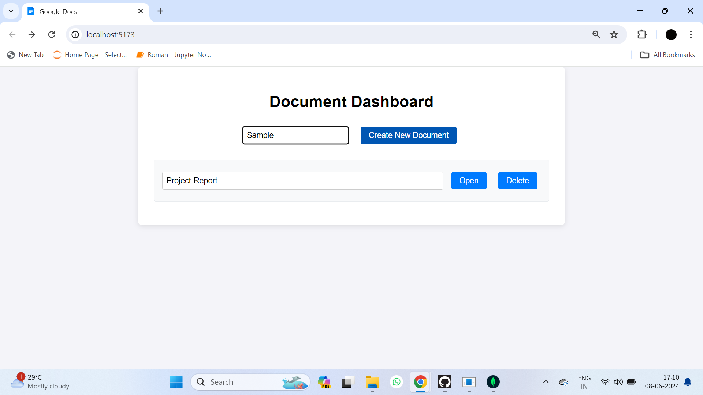

# Google Docs Clone

This project is a robust and feature-rich collaborative text editor built using the MERN stack (MongoDB, Express, React, and Node.js) and Quill for the text editor component. It supports real-time synchronization and collaboration among multiple users through WebSockets, facilitated by Socket.IO. Users can create, edit, and save documents, with changes being instantly shared among all connected clients, ensuring seamless real-time collaboration. Additionally, the editor includes support for image uploads via a custom toolbar button, enhancing the document editing capabilities.

## Screenshots

### Development


### Dashboard


### Real-Time Editing


### Image Upload


### Database


## Features

- Real-time collaborative editing
- Document creation, editing, and saving
- Image uploads via custom toolbar button
- Instant synchronization across clients
- MongoDB integration for document storage

## Technologies Used

- React
- Quill
- Socket.IO
- Node.js
- Express
- MongoDB
- Multer

## Folder Structure

The project is structured into two main directories: `client` and `server`.

### Client

The `client` directory contains the frontend code built with React.

- `src`: Contains the source code for the React application.
  - `components`: Contains React components like `TextEditor` and `Header`.
  - `App.js`: Main application component.
  - `index.js`: Entry point of the React application.
- `public`: Contains the public assets for the application.
- `package.json`: Lists the frontend dependencies and scripts.

### Server

The `server` directory contains the backend code built with Express.

- `uploads`: Directory to store uploaded images.
- `Document.js`: Mongoose schema for documents.
- `server.js`: Main server file which sets up Express, Socket.IO, and MongoDB.
- `.env`: Environment variables for the server.
- `package.json`: Lists the backend dependencies and scripts.

## Dependencies

### Client

- **React**: A JavaScript library for building user interfaces.
- **Quill**: A rich text editor.
- **Socket.IO-client**: Real-time communication library for the frontend.
- **Vite**: A fast development server and build tool for modern web projects.

### Server

- **Express**: A web framework for Node.js.
- **Mongoose**: A MongoDB object modeling tool.
- **Socket.IO**: Real-time communication library for the backend.
- **Multer**: A middleware for handling multipart/form-data, used for image uploads.
- **dotenv**: A module to load environment variables from a `.env` file.

## How to Run the Project

1. **Clone the repository:**

    ```bash
    git clone https://github.com/vasanthsai14/Google-Docs-Clone.git
    ```

2. **Navigate to the project directory:**

    ```bash
    cd Google-Docs-Clone
    ```

3. **Install the dependencies for the client:**

    ```bash
    cd client
    npm install
    ```

4. **Start the client:**

    ```bash
    npm run dev
    ```

5. **Install the dependencies for the server:**

    ```bash
    cd ../server
    npm install
    ```

6. **Set up environment variables:**

    Create a `.env` file in the `server` directory and add the following variables:

    ```
    MONGO_URI=your_mongodb_connection_string
    ```

7. **Start the server:**

    ```bash
    npm start
    ```

8. **Open your browser and go to:**

    ```
    http://localhost:5173
    ```

## Socket.IO Explanation

Socket.IO is a JavaScript library for real-time web applications. It enables real-time, bidirectional, and event-based communication between web clients and servers. Socket.IO consists of two parts:

- A server-side library for Node.js
- A client-side library that runs in the browser

### Key Concepts:

- **Connection:** Establishes a connection between the client and server.
- **Events:** Named messages sent between the client and server.
- **Broadcasting:** Sending a message to multiple clients.

### Example Usage:

In the server code:
```javascript
io.on("connection", (socket) => {
  socket.on("get-document", async (documentId) => {
    const document = await findOrCreateDocument(documentId);
    socket.join(documentId);
    socket.emit("load-document", { title: document.title, contents: document.data });

    socket.on("send-changes", (delta) => {
      socket.broadcast.to(documentId).emit("receive-changes", delta);
    });

    socket.on("save-document", async (data) => {
      await Document.findByIdAndUpdate(documentId, { data });
    });
  });
});

